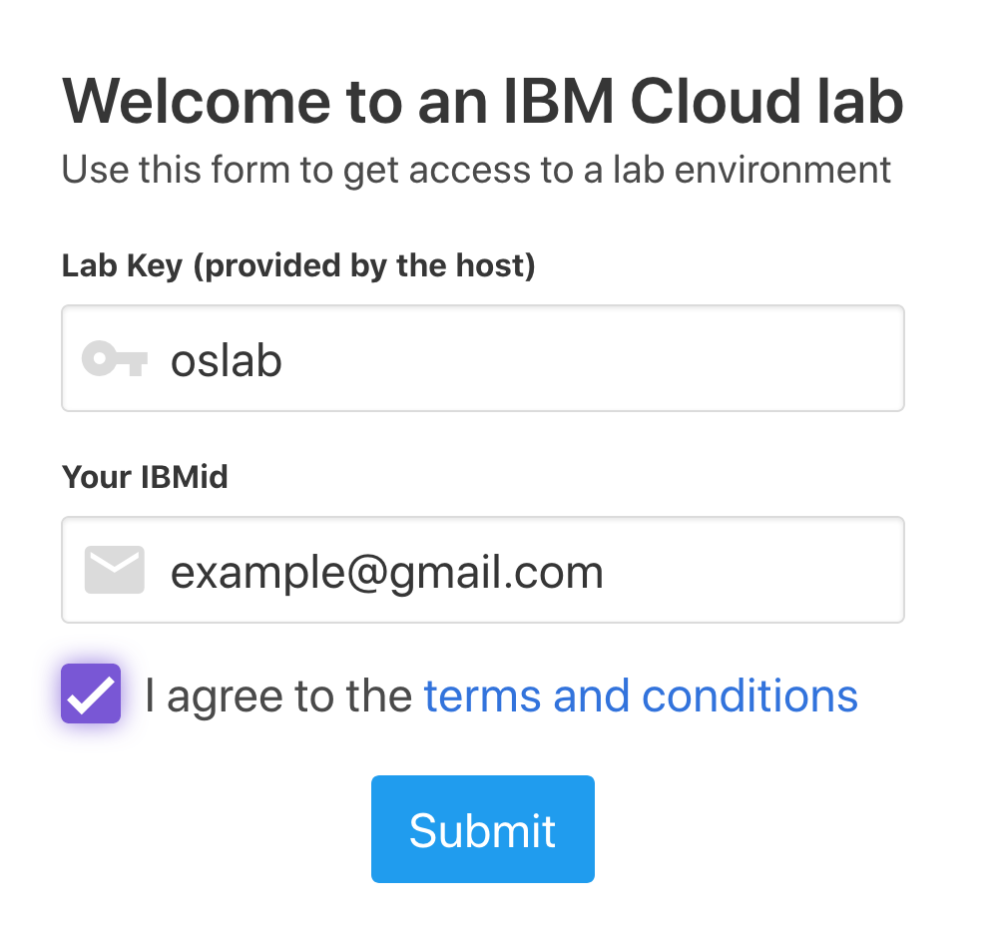
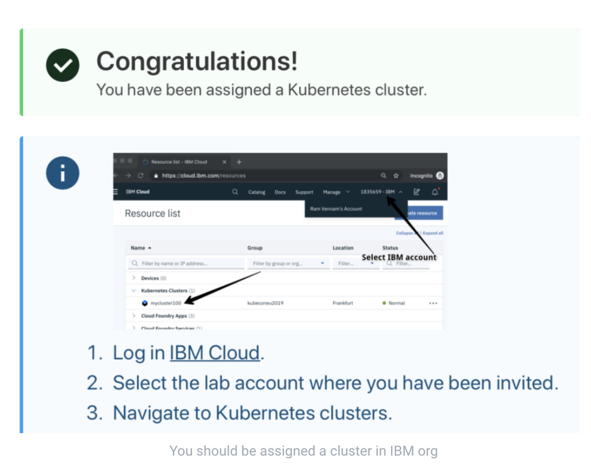
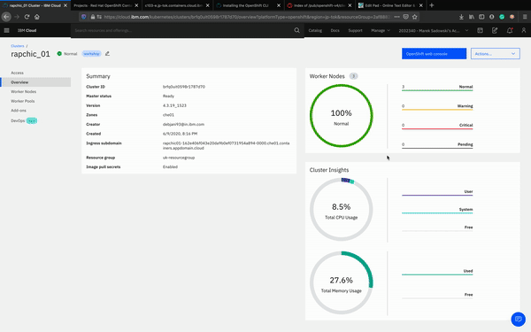
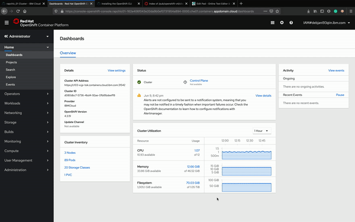
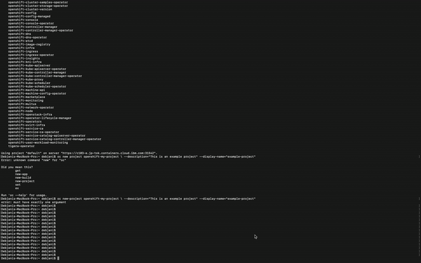
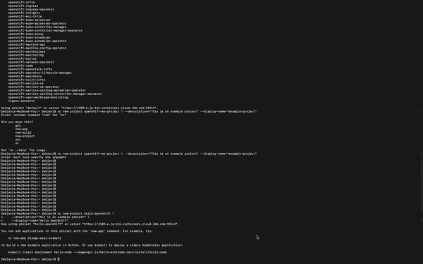
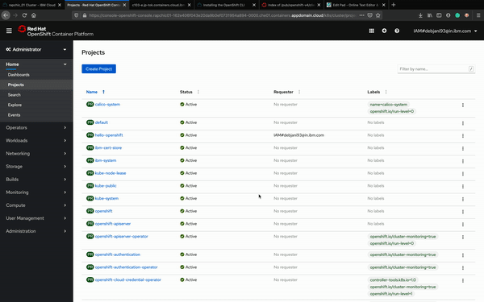
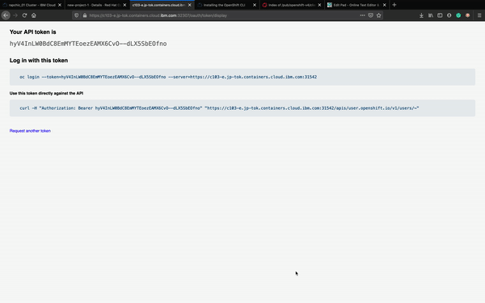
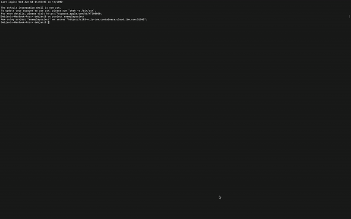
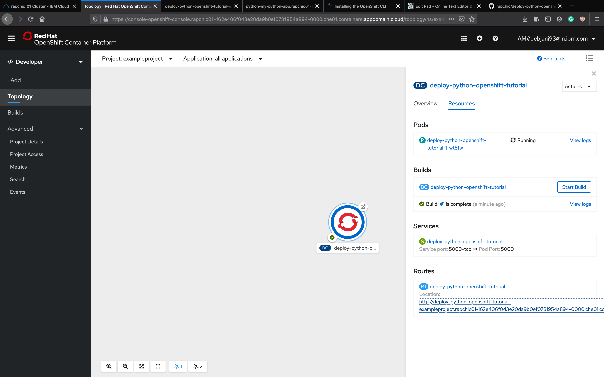

# The Ultimate Kubernetes with RedHat OpenShift workshop series: Webcast 2

This part of the workshop is divided in 5 sections:

1. Accessing Openshift Cluster for the workshop
2. Getting started on Openshift Platform on IBM Cloud
- Overview of Openshift on IBM Cloud
- Overview of the Openshift console
- Setting up command line tools to access your cluster
3. Working with projects in Openshift
- Create a project on console and delete from CLI
- Create a project from CLI and delete from console
4. Deploy an application to Openshift
- Deploying to Openshift via 'oc' CLI
- Deployment of code in Github repos
- Source to image (S2I) deployment
5. Trigerring an auto build using GitHub webhooks

## 1. Accessing Openshift Cluster for the workshop

For the purpose of this workshop organizers pre-provisioned for attendees free Red Hat OpenShift Clusters. Thanks to that you can try and learn on how to use them.

The specification of these Red Hat OpenShift clusters is the following:

`3 Worker Nodes
Each Worker Node has 4 CPU cores with 16GB Ram
The abbreviated description:
3 x 4 x 16`

Use this URL to claim the clusters: https://os201ws.mybluemix.net/admin

Enter the Lab Key given by your instructor, as well as the email address associated with your IBM Cloud account.

After you hit submit, you will be given a cluster for the duration of the workshop.

You should be given the result page showing the successful assignment.

When you sign up / log in to IBM Cloud, from the Dashboard you need to navigate to IBM Org, you can see the option above 'Create Resources tab' beside Docs and Support.

Next, go to the resource list, from the hamburger menu top left to verify your cluster.

Congratulations! You obtained a Red Hat OpenShift 4.3 cluster. Now you are ready for Lab 2.

## 2. Getting started on Openshift Platform on IBM Cloud

https://cloud.ibm.com/docs/openshift?topic=openshift-deploy_app#app_cli

## 3. Working with projects in Openshift

Create a project on console

View project from CLI

Create a project from CLI

View project on console

Delete project on console

Delete project from CLI

4. Deploy an application to Openshift

View deployed app

- Deployment of code in Github repos

Deployment successful

- Source to image (S2I) deployment

Fork/Clone this example Python repo so that you can edit on the next step https://github.com/sclorg/django-ex

5. Trigerring an auto build using GitHub Webhooks

More on Webhooks : https://docs.openshift.com/container-platform/4.1/builds/triggering-builds-build-hooks.html
